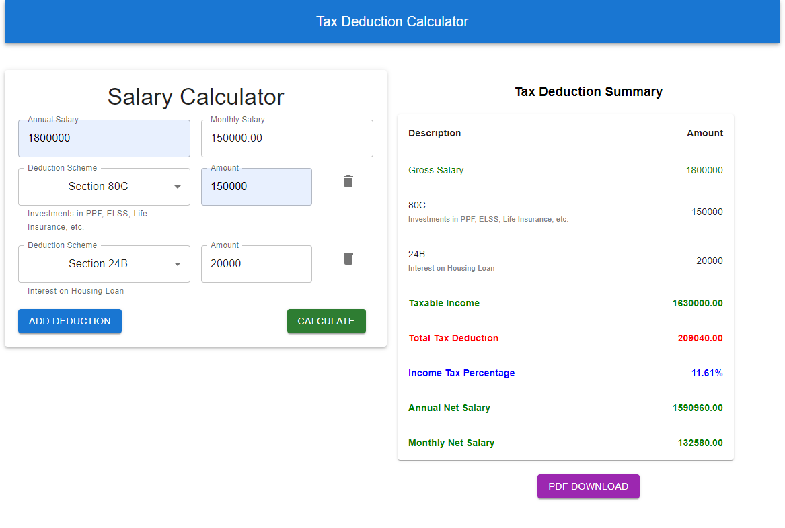

# Tax deduction calculator  

## Available Scripts

In the project directory, you can run:

### `npm install`

### `npm start`

### `npm run build`

Runs the app in the development mode.\
Open [http://localhost:3000](http://localhost:3000) to view it in your browser.

